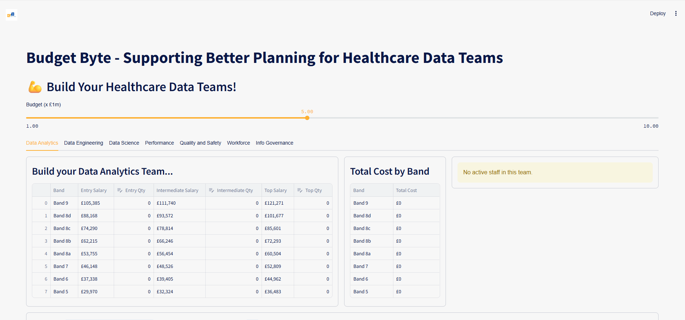

# SWAIH - Southwest Data Science Hub

## Budget Byte - Supporting Better Planning for Healthcare Data Teams

### A tool to help with allocating budget across Healthcare Data Teams.
- Data Analytics
- Data Engineering
- Data Science
- Performance
- Quality and Safety
- Workforce
- Info Governance

